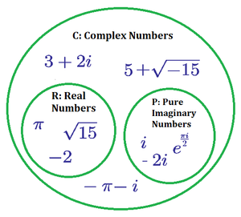

# Implementation-of-a-complex-number

## Usage
**The main attributes and methods of the Complex class:**

* __init__(self, r, a): Class constructor, takes the real and argument parts of a complex number and calculates the corresponding complex form.
* re: Property for accessing the real part of a complex number (read only).
* im: Property for accessing the imaginary part of a complex number (read only).
* __add__(self, o): Overloaded addition operator for complex numbers.
* __sub__(self, o): Overloaded subtraction operator for complex numbers.
* __mul__(self, o): Overloaded multiplication operator for complex numbers.
* __truediv__(self, o): Overloaded division operator for complex numbers.
* cabs(self): A method that calculates the modulus (absolute value) of a complex number.
**The example creates two Complex objects, z1 and z2, and performs addition, subtraction, multiplication, and division operations between them. The modulus of the complex number z1 is also calculated.**

**This code demonstrates creating and working with complex number objects in trigonometric form.**
