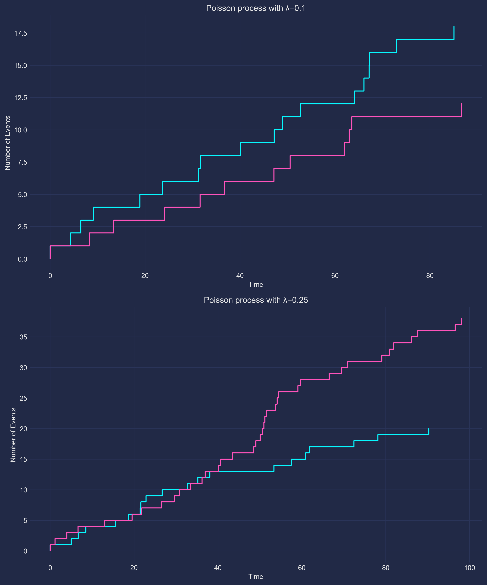

# Process_of_Poisson-s
[](https://www.python.org/downloads/)
[](https://numpy.org/)
[](https://matplotlib.org/stable/)
[](https://pypi.org/project/mplcyberpunk/)
[](https://git.io/typing-svg)


<p align="center">
   
</p>

<div>
<h1>Poisson process</h1>
<p>The code creates an object-oriented implementation of the Poisson process in Python and
uses matplotlib to visualize the resulting trajectories.</p>


<h2>Import required libraries:</h2>

<p>Numpy is used to generate random numbers from appropriate distributions.
matplotlib.pyplot is used to create plots. mplcyberpunk is used to apply a cyberpunk style to graphics.</p>

<h2>PoissonProcess class</h2>
<p>The PoissonProcess class is created with two methods:</p>

<p>The __init__ constructor takes an intensity intensity and a finite time T for a Poisson process.
The generate_trajectory method generates a Poisson process trajectory according to the specified intensity and time limit.
The plot_trajectories function accepts a list of trajectories of Poisson processes and a list of corresponding labels and visualizes each trajectory on a separate subplot.</p>

<p><span style="color: red;">In</span> <span style="color: orange;">block</span> <span style="color: yellow;">if</span > <span style="color: green;">__name__</span> <span style="color: blue;">==</span> <span style="color: indigo;">"__main__":< /span></p>

<p>Intensity values (lambdas) and limit time (T) are determined.
For each intensity value, a PoissonProcess object is created and two trajectories are generated, which are stored in the trajectories list.
A list of labels is created for each Poisson process.
The plot_trajectories function is called to visualize the trajectories.</p>

</div>

## Requirements
- <span style="color: red;">Python 3.x</span>
- <span style="color: orange;">NumPy</span>
- <span style="color: yellow;">Matplotlib</span>
- <span style="color: green;">mplcyberpunk</span>

## Usage
1. Clone the repository to your local computer:

```
git clone https://github.com/your-username/your-repository.git
```

Go to your folder:
```
cd your-repository
```

2. Install the necessary dependencies by running the following command:

```shell
pip install -r requirements.txt
```

3. Visualize the trajectories using the plot_trajectories function:

```
plot_trajectories(trajectories, labels)
```

This will create a graph with the trajectories of the Poisson processes.

## Cyberpunk style
The code uses the cyberpunk style for matplotlib plots.
The mplcyberpunk library is used to apply the cyberpunk style.
The cyberpunk style is set with the following line of code:

```
plt.style.use("cyberpunk")
```

## License
This code is licensed under the [MIT License](LICENSE).
Feel free to use and modify it according to your needs.

## Gratitude
- <span style="color: red;">Poisson process implementation inspired by https://en.wikipedia.org/wiki/Poisson_point_process .</span>
- <span style="color: orange;">The cyberpunk style for matplotlib is applied using the mplcyberpunk library.</span>
- <span style="color: yellow;">We hope you enjoy exploring the world of Poisson processes using cyberpunk visualization!</span>