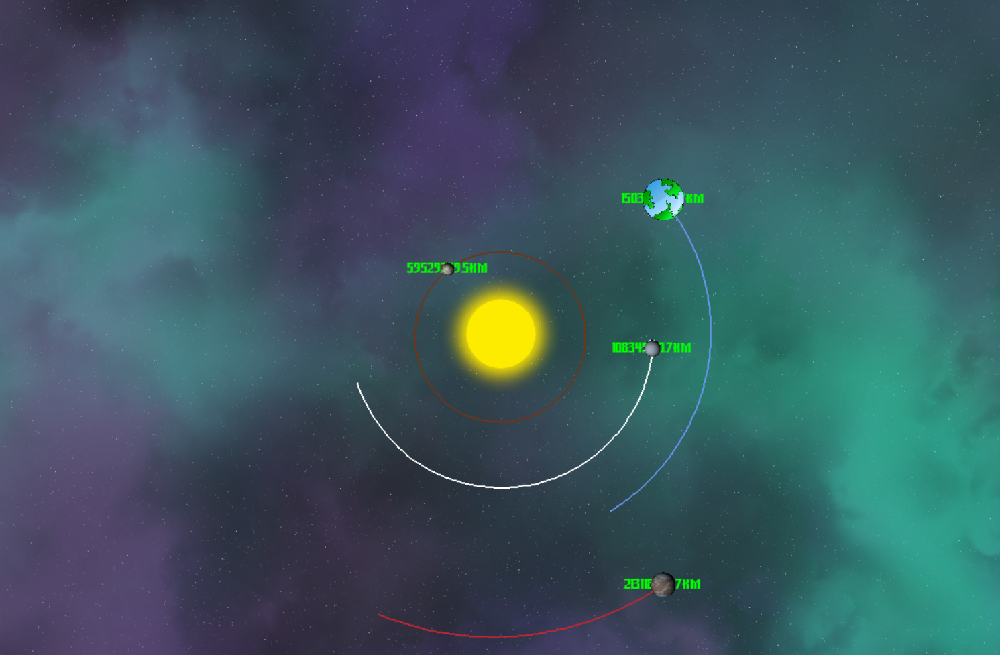

# Симуляція планет

[](https://www.python.org/downloads/)
[](https://www.pygame.org/news)

[](https://git.io/typing-svg)

**This is a planetary simulation program developed using the Pygame library in Python. It models the movement and orbits of the planets around the central Sun.**

## Installation

1. Clone the repository to your local computer or download the source code files.

```shell
https://github.com/VAlduinV/Planet_simulation.git
```

2. Make sure you have Python (version 3.x) installed on your system.
3. Install the necessary dependencies by running the following command:

```shell
pip install -r requirements.txt
```

4. Place the planet textures in the "images" folder.


## Usage

To run the simulation, run the following command in a terminal or command prompt:
    
```shell
python PL_SL.py
```


Management:
- Close the simulation window to exit the program.

## How it works

The program uses the Pygame library to create a graphical simulation window. It defines the class `Planet', which represents the planet in the simulation. Each planet has attributes such as position, radius, color, mass, and texture. The planets interact with each other through gravitational forces.

The simulation starts with a central Sun and several planets orbiting it. The initial positions and velocities of the planets are set to approximate real values. The simulation calculates the gravitational forces between each pair of planets and updates their positions accordingly.

The program uses a simple physical simulation approach with a fixed time step to update the planetary positions. The simulation continues until the window is closed.

## Settings

You can customize the simulation by changing the following parameters:

- `WIDTH` and `HEIGHT`: Set the dimensions of the simulation window.
- `Planet` constructor: You can create additional planets or modify existing ones by changing the parameters passed to the `Planet` class.
- Planet textures: You can replace existing planet textures with your own. Make sure the new images are in the "images" folder and update the file paths accordingly.

## Cooperation

Contributions to this project are welcome. You can contribute by submitting bug reports, suggestions for improvements, or implementing new features. Please create a new issue or send a pull request to the project repository.

## License

This project is available under the [MIT License](LICENSE).

## Acknowledgments

- Pygame library: [https://www.pygame.org](https://www.pygame.org)
- Image of planet textures: [NASA Solar System Exploration](https://solarsystem.nasa.gov/resources/2437/solar-system-and-beyond-poster-set/) (Public Domain)

## Contact Information

If you have any questions, suggestions or feedback, feel free to contact me at [prime72w@gmail.com](mailto:prime72w@gmail.com).

Enjoy the simulation!
